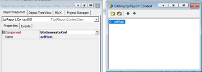
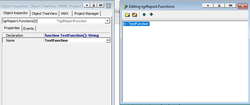
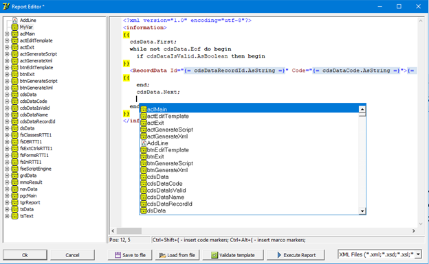

1.  Общие сведения

Добрый день уважаемые коллеги!

Хочу представить Вам набор компонентов **TextGenDel** (**Text**
**gen**erator for **Del**phi), реализующих генератор шаблонов для Delphi
7 + (на момент публикации Delphi 7 и Delphi 11.3).

При разработке бизнес приложений часто ставится задача экспорта данных в
текстовые форматы (XML, JSON, CSV). Заказчик определяет формат
выгружаемого текстового файла в виде набора правил, определяющих
отражение исходного массива данных приложения на результирующий файл
экспорта. Зачастую подобные правила содержат массу условий, в
зависимости от выполнения или невыполнения которых содержимое результата
должно меняться. Подобную сложную логику реализовать декларативно не
всегда представляется возможным, и поэтому приходится разрабатывать
отдельные программные модули, реализующие её.

Также, в составе постановки задачи экспорта часто прикладываются образцы
результирующих текстовых файлов, содержащие тестовые данные для
различных исходных данных.

***Простой файл образца***

Такие файлы – образцы результатов легко можно преобразовать в файлы –
шаблоны, содержащие вместо конкретных тестовых данных
**макроопределения** – ссылки на данные приложения. Кроме того, шаблон
может содержать **участки программного кода** (вставки – скрипты),
реализующие сложную логику отображения данных на результирующий файл.

***Шаблон, созданный на основании файла образца в редакторе шаблонов
TextGenDel***

Итоговый шаблон обрабатывается генератором шаблонов – и в результате
формируется выходные текстовые данные.

Набор компонентов **TextGenDel** реализует подобный генератор шаблонов.
Принцип его работы следующий: исходный шаблон преобразуется в
программный код **Pascal**. Далее этот программный код исполняется и
формирует результирующий текст.

В качестве механизма исполнения программного кода **TextGenDel**
использует компоненты **FastScript**, являющиеся частью широко
используемого генератора отчетов **FastReport**.

Язык **FastScript** Pascal – легко расширяемый (в том числе и в
Runtime). Кроме того, компоненты **FastScript** предоставляют доступ к
зарегистрированным метаданным, что позволяет реализовать удобный
редактор шаблонов.

2.  **Развертывание компонентов**

Предварительно необходимо установить в IDE компоненты **FastScript**
версии 1.9+ (они присутствуют в составе набора компонентов
**FastReport** 5+).

Далее необходимо загрузить исходный код компонентов **TextGenDel**,
расположенный по адресу <https://github.com/vvboborykin/TextGenDel>
(используя либо функцию клонирования git, либо загрузив ZIP архив
исходных текстов, и распаковав его на Вашем компьютере).

Для IDE Delphi 7

После этого, откройте в Delphi группу проектов **TextDelGenGroupD7** из
каталога TextGenDel.

Последовательно установите пакеты компонентов **TextGenDelD7** и
**TextGenDelFastScriptD7**.

После установки пакетов, на палитре компонентов IDE появится закладка
**TextGenDel** содержащая два компонента

Первый компонент - собственно генератор шаблонов (**TtgdReport**).

Второй компонент - сервис исполнения скриптов на основе **FastScript**
(**TtgdFastScriptEngineFactory**).

Третий пакет, включённый в состав группы (**TextGenDelEditor7**),
содержит специализированный редактор шаблонов для компонента
**TtgdReport** (может быть использован как в Design так и в Run Time). В
составе этого пакета используется бесплатный набор компонентов
**SynEdit** (<https://github.com/SynEdit/SynEdit>). В случае, если Вы
решите использовать этот редактор, то предварительно необходимо
установить компоненты **SynEdit** в вашей IDE. После этого установите
пакет **TextGenDelEditor7**.

Последний шаг в развёртывании компонентов - включение каталога исходных
текстов TextGenDel\Sources в список путей библиотек в параметрах IDE

Развертывание компонентов в IDE Delphi 11 подобно описанному выше,
используя группу проектов **DelphiGenTextD11**.

3.  Описание компонентов

Компонент **TtgdReport** (генератор шаблонов) имеет следующие свойства:

- **AddLineFunctionName** - имя функции в скрипте генерации,
  используемой для добавления новой строки в результат генерации. Можно
  не менять, если имя по умолчанию не конфликтует с именами функций,
  используемых в других местах шаблона / библиотеках скриптов. Должно
  быть корректным идентификатором Pascal функции.

- **CodeBeginMarker** – строка - маркер **начала блока программного
  кода** в шаблоне. Текст, следующий после этого маркера в шаблоне,
  считается программным кодом (скриптом), и при генерации никак не
  изменяется, а исполняется. Маркер начала блока программного кода
  должен начинать первую строку блока кода / быть первым в первой строке
  блока кода.

- **CodeEndMarker** – строка - маркер **конца блока программного кода**
  в шаблоне. Должна завершать блок программного кода (завершать
  последнюю строку блока)

- **Context** - коллекция ссылок на компоненты (например, на внешние
  модули данных), которые могут быть использованы в шаблоне. Компоненты,
  расположенные на том же контейнере (форме, модуле данных) что и сам
  компонент генератора отчётов не требуют таких ссылок (смотри свойство
  UseOwnerAsContext)

> 

- **Functions** – коллекция функций расширения языка программного кода,
  которые могут быть использованы в шаблоне. Для каждой из функций
  свойство **Declaration** должно содержать объявление функции, свойство
  **Name** - её имя.

> 

Обработчик события OnExecute функции расширения, определяет фактическую
функциональность функции расширения (что делается при ее вызове).
Параметр AParams обработчика, содержит массив переданных при вызове
функции в шаблоне параметров, результат обработчика - результат
исполнения функции расширения, возвращаемый в шаблон.

Используя коллекцию **Functions** Вы можете нарастить функциональность
языка шаблонов, добавив в него необходимые, часто используемые у Вас,
функции (форматирования, конвертирования и т.п.).

- **MacroBeginMarker** – строка - **маркер начала макроопределения** в
  шаблоне. Текст находящийся в шаблоне после строки **маркера начала
  макроопределения** и до начала строки **маркера окончания
  макроопределения**, считается выражением на языке программного кода,
  значение которого необходимо вычислить при генерации, и подставить
  вместо макроопределения.

Например, макроопределение шаблона {=
SomeField.AsString =} при генерации будет заменено на строковое
представление текущего значения поля SomeField.

- **MacroEndMarker** – строка - **маркер окончания макроопределения** в
  шаблоне.

- **ScriptEngineFactory** - ссылка на компонент - службу исполнения
  скриптов. Это свойство обязательно должно быть заполнено ссылкой на
  экземпляр компонента **TtgdFastScriptEngineFactory**.

- **SyntaxName** - формат синтаксиса шаблона. Используется при работе
  редактора компонента, определяет расцветку шаблона в редакторе. На
  другую функциональность не влияет

- **TemplateLines** - строки шаблона, обрабатываемые при генерации

- **UseOwnerAsContext** - признак использования контейнера (владельца /
  **Owner**) компонента **TtgdReport**, как контекста данных. В случае,
  если это логическое свойство имеет значение **True**, то все
  компоненты, содержащиеся на том же контейнере, что и компонент
  **TtgdReport**, могут быть использованы в его шаблоне. Например, если
  на форме (или в модуле данных) содержащем компонент **TtgdReport**
  присутствует экземпляр **TClientDataSet** с именем **cdsData**, то в
  блоках программного кода и макроопределениях шаблона можно будет
  ссылаться на этот компонент используя его имя **cdsData**.

Кроме того, в контекст включаются и экземпляры вложенных **TFrame** со
своим содержимым, расположенные на контейнере – владельце.

- **Variables** - коллекция именованных значений, которые могут быть
  использованы в шаблоне

> 

Компонент реализует следующие методы, используемые для работы с
шаблонами и генерации текстов

- **procedure** GenerateText(AResultLines: **TStrings**);

> Метод генерирующий текст на основании шаблона, хранящегося в
> компоненте, с использованием контекста данных и зарегистрированных
> функций расширения. Результат генерации помещается в параметр
> AResultLines передаваемый при вызове метода.

- **procedure** GenerateScript(AResultLines: **TStrings**);

> Метод, преобразующий шаблон хранящийся в компоненте, в программный код
> скрипта, с использованием контекста данных. Результат преобразования
> помещается в параметр AResultLines передаваемый при вызове метода

- **procedure** ValidateTemplate;

> Метод производящий проверку корректности шаблона, хранящегося в
> компоненте, с учётом контекста данных и зарегистрированных функций
> расширения. Формирует программный код скрипта, и далее пытается
> скомпилировать его, используя сервис выполнения скриптов, связанный с
> компонентом. В случае ошибки компиляции, выбрасывается исключение,
> содержащее информацию о месте зарегистрированной ошибки.

4.  Использование компонентов TextGenDel

Порядок использования компонентов **TextGenDel** можно рассмотреть,
исследуя простой тестовый проект, включённый в состав пакета
компонентов. Проект расположен в каталоге TextGenDel\Demo\D7\FastScript.

Проект состоит из базовой формы, а также унаследованной от неё главной
формы приложения.

Главная форма приложения содержит набор данных cdsData, который будет
использоваться как источник данных при заполнении шаблона. Набор данных
имеет в своём составе четыре поля.

Также, главная форма содержит компоненты генератора шаблонов tgrReport
(собственно сам генератор шаблонов) и fseScriptEngine (сервис исполнение
скрипта шаблона). Компонент tgrReport ссылается на fseScriptEngine
свойством ScriptEngineFactory.

Кроме того, форма содержит компоненты расширения функциональности языка
скриптов FastScript: fsClassesRTTI1, fsFormsRTTI1, fsExtCtrlsRTTI1,
fsIniRTTI1, fsDBRTTI1. Эти компоненты позволяют использовать в
программном коде шаблона элементы стандартных модулей Delphi (подробнее
смотри документацию компонентов FastScript).

После запуска приложения на экран выводится главная форма.

Закладка Data содержит таблицу с данными добавленными в cdsData при
создании формы.

Для просмотра и редактирования шаблона нажмём на кнопку EditTemplate.

На экран будет выведен редактор шаблона. В левой части редактора
расположено дерево контекстных компонентов, на которые допустимы ссылки
в шаблоне. Также, в нём отображаются функция расширения,
зарегистрированные в коллекции Functions, и переменные
зарегистрированные в коллекции Variables компонента генератора шаблонов.

Редактор текста шаблона реализует цветовое выделение программного кода,
макроопределений, а также раскрашивает строки шаблона в соответствии с
выбранным синтаксисом. Также, в редакторе реализован механизм подсказок
при наборе текста (вызываемый нажатием клавиш Ctrl + Space), подобный
Code Inside в IDE Delphi.

Для сохранения изменений, внесённых в текст шаблона, необходимо нажать
OK; для отказа от них кнопку Cancel. Функции остальных кнопок
соответствуют их названиям.
